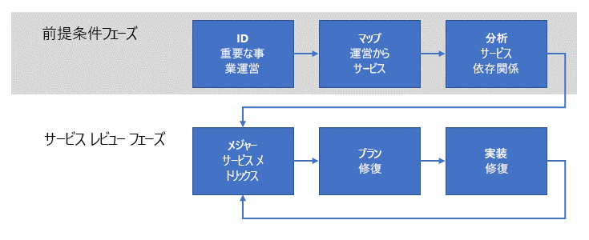

# 運用適合性レビューの確立

企業が Azure でワークロードの運用を開始したら、次のステップは、これらのワークロードに対する**非機能的な**要件を列挙し、実装して、繰り返し確認するための**運用適合性レビュー** プロセスを確立することです。 "_非機能的_" 要件とは、サービスの予期される運用的な動作に関連します。 非機能的要件の 5 つの主要カテゴリは、スケーラビリティ、可用性、回復性 (事業継続とディザスター リカバリーを含む)、管理、セキュリティであり、[ソフトウェア品質の重要な要素](../../guide/pillars.md)と呼ばれます。 運用適合性レビュー プロセスの目的は、ミッション クリティカルなワークロードが品質の重要な要素に関するビジネスの期待を満たしていることを確認することです。

そのためには、企業は運用適合性レビュー プロセスを実施して、運用環境でワークロードを実行することが原因で発生する問題を完全に理解し、問題を修復する方法を決定して、解決する必要があります。 この記事では、企業がこの目標を達成するために使用できる高レベルの運用適合性レビュー プロセスの概要について説明します。

## Microsoft での運用適合性

Azure プラットフォームの開発は、最初から、Microsoft 全体の多くのチームによって行われる継続的な開発と統合プロジェクトでした。 基本的な非機能的要件を定期的に列挙して実装するための堅牢なプロセスがなかったら、Azure の大規模で複雑なプロジェクトの品質と一貫性を確保することは非常に困難でした。

Microsoft が実施したこれらのプロセスが、このドキュメントで概要を説明することの基礎を形成しています。

## 問題の理解

「[概要](../../cloud-adoption/getting-started/overview.md)」で説明したように、企業のデジタル変革の最初のステップは、Azure を採用することによって解決するビジネス上の問題を明らかにすることです。 次のステップは、クラウドへのワークロードの移行や、既存のオンプレミス サービスの対応によるクラウド機能の組み込みなど、問題に対する高いレベルでの解決策を決定することです。 最後に、解決策を設計して実装します。

このプロセスの過程で、サービスの "_機能_" に頻繁に注目します。 つまり、サービスを実行するために必要な "_機能_" の要件のセットがあります。 たとえば、製品配送サービスでは、製品の出荷場所と配達先の場所の決定、配送中の製品の追跡、顧客への通知などの機能が必要です。

これに対し、"_非機能的_" な要件は、サービスの[可用性](../../checklist/availability.md)、[回復性](../../resiliency/index.md)、[スケーラビリティ](../../checklist/scalability.md)などのプロパティに関係します。 これらのプロパティは、サービスの特定の機能の最終的な動作に直接影響しないため、機能的要件とは異なります。 ただし、これらの非機能的要件は、サービスの "_パフォーマンス_" や "_継続性_" に関係します。

一部の非機能的な要件は、サービス レベル アグリーメント (SLA) の観点で指定できます。 たとえば、サービスの継続性に関しては、サービスの可用性要件を **99.99% の時間で利用可能**のようなパーセンテージとして表現できます。 他の非機能的要件は、定義がさらに難しく、運用ニーズが発展すると変化することがあります。 たとえば、コンシューマー向けサービスは、需要急増後に予期しないスループット要件に直面し始める可能性があります。

![注] RPO、RTO、SLA、および関連する概念の説明など、回復性に関する要件の定義について詳しくは、「[回復性に優れた Azure 用アプリケーションの設計](../../resiliency/index.md#define-your-availability-requirements)」をご覧ください。

## 運用適合性レビューのプロセス

企業のサービスのパフォーマンスと継続性の維持において重要なのは、"_運用適合性レビュー_" のプロセスを実装することです。

概要レベルでは、プロセスには 2 つのフェーズがあります。 前提条件フェーズでは、要件が確立されて、サポート サービスにマップされます。 これは頻繁には行われません。おそらく、年 1 回や、新しい運用の導入時です。 前提条件フェーズの出力は、フロー フェーズで使用されます。 フロー フェーズはさらに頻繁に発生します。推奨されるのは毎月です。

### 前提条件フェーズ

このフェーズのステップでは、重要なサービスの定期的なレビューを実施するために必要な要件をキャプチャします。

- **重要なビジネス操作を識別する**。 企業のミッション クリティカルなビジネスの業務を識別します。 ビジネス操作は、すべてのサポート サービス機能から独立しています。 つまり、ビジネス操作は、ビジネスで実行する必要があり、IT サービスのセットによってサポートされる、実際のアクティビティを表します。 **ミッション クリティカル** (または**ビジネス クリティカル**) という用語は、業務が妨げられた場合のビジネスに対する重大な影響を示します。 たとえば、オンライン小売業には、"客がショッピング カートに商品を追加できるようにする" や "クレジット カードの支払いを処理する" といったビジネス操作が存在する場合があります。 これらの操作のいずれかが失敗した場合、客は取引を完了できず、企業は販売の実現に失敗します。

- **操作をサービスにマップする**。 これらのビジネス操作を、それらをサポートするサービスにマップします。 上のショッピング カートの例では、在庫管理サービスやショッピング カート サービスなど、複数のサービスが関係する場合があります。 上のクレジット カード支払いの例では、オンプレミスの支払いサービスがサードパーティの支払い処理サービスと対話する可能性があります。

- **サービスの依存関係を分析する**。 ほとんどのビジネス操作には、複数のサポート サービス間のオーケストレーションが必要です。 サービス間の依存関係と、これらのサービスからのミッション クリティカルなトランザクションのサービス間のフローを理解しておくことが重要です。 オンプレミスのサービスと Azure サービスの間の依存関係についても考慮する必要があります。 ショッピング カートの例では、在庫管理サービスはオンプレミスでホストされて、物理的な倉庫から従業員によるデータ入力を取り込みますが、データは [Azure Storage](/azure/storage/common/storage-introduction) などの Azure サービスや [Azure Cosmos DB](/azure/cosmos-db/introduction) などのデータベースに格納される場合があります。

これらのアクティビティからの出力は、サービス操作に対する**スコアカード メトリック**のセットです。 メトリックは、可用性、スケーラビリティ、ディザスター リカバリーなどの非機能的な条件の観点から分類されます。 スコアカードのメトリックは、サービスの操作で満たすことが期待される条件を表します。 これらのメトリックは、サービス操作に適した任意の細分性レベルで表現できます。

スコアカードは、ビジネス所有者とエンジニアリングの間の意味のあるディスカッションを容易にするために簡単な用語で表す必要があります。 たとえば、スケーラビリティ スコアカードのメトリックでは、望ましい条件で動作している場合は "_緑_"、望ましい条件を満たしていないが計画的な修復をアクティブに実装している場合は "_黄_"、望ましい条件を満たしていなくて計画もアクションもない場合は "_赤_" で表すことができます。

これらのメトリックがビジネス ニーズを直接反映する必要があることを強調することが重要です。

### サービス レビュー フェーズ

サービス レビュー フェーズは、運用適合性レビュー プロセスの中核です。

- **サービス メトリックを測定する**。 スコアカードのメトリックを使用してサービスを監視し、ビジネス要件を満たすことを確認する必要があります。 つまり、サービスの監視が不可欠です。 非機能的要件に関してサービスのセットを監視できない場合、対応するスコアカード メトリックは赤であると見なす必要があります。 この場合、修復のための最初のステップは、適切なサービス監視を実装することです。 たとえば、サービスに対するビジネス要件が 99.99% の可用性での動作であるのに、可用性を測定するためのテレメトリが運用環境にない場合は、要件が満たされていないものと想定する必要があります。

- **修復を計画する**。 許容されるしきい値を下回ったメトリックがあるサービス操作の場合、操作を許容できるメトリックにするためのサービスの修復コストを決定します。 サービスの修復コストがサービスの予想収益より大きい場合は、顧客エクスペリエンスなどの実体のないコストの考慮に移ります。 たとえば、顧客がサービスを使用して注文しにくい場合は、競合企業を選択する可能性があります。

- **修復を実装する**。 ビジネス所有者とエンジニアリングの間でプランがまとまった後、プランを実装する必要があります。 スコアカードのメトリックを確認するたびに、実装の状態を報告する必要があります。

このプロセスは反復的であり、それを担当する専用チームを設けるのが理想的です。 このチームは、定期的にミーティングを行って、既存の修復プロジェクトを検討し、新しいワークロードの基礎レビューを開始し、企業の全体的なスコアカードを追跡する必要があります。 このチームには、スケジュールが遅れていたりメトリックを満たせていない修復チームに対して説明責任を要求する権限があります。

## 運用適合性レビュー チームの構成

運用適合性レビュー チームは、次の役割で構成されます。

1. **ビジネス所有者**。 この役割は、各ミッション クリティカルなビジネスの業務を識別して優先順位を付けるためのビジネス知識を提供します。 また、軽減コストをビジネスへの影響と比較し、修復に関する最終的な決定を下します。

2. **ビジネス アドボケイト**。 この役割は、ビジネス操作を個別の部分に分割し、これらの部分をオンプレミスとクラウドのサービスとインフラストラクチャにマッピングします。 この役割には、各ビジネス操作に関連付けられているテクノロジの深い知識が必要です。

3. **エンジニアリング所有者**。 この役割は、ビジネス操作に関連付けられているサービスの実装を担当します。 各人は、運用適合性レビュー チームによって発見された非機能的要件の問題を解決するための解決策の設計、実装、展開に参加する場合があります。

4. **サービス所有者**。 この役割は、ビジネスのアプリケーションとサービスの運用を担当します。 これらのアプリケーションとサービスのログ記録と使用状況のデータを収集します。 このデータは、問題の特定と、展開後の修正の確認の両方に使用されます。

## 運用適合性レビュー ミーティング

運用適合性レビュー チームには定期的にミーティングを開くことをお勧めします。 たとえば、毎月ミーティングを行い、四半期ごとに上級リーダーに状態とメトリックを報告します。

プロセスとミーティングの詳細は、特定のニーズに合わせて調整する必要があります。 以下のタスクから始めることをお勧めします。

1. ビジネス所有者とビジネス アドボケイトは、エンジニアリングとサービス所有者からの入力を基にして、各ビジネス操作の非機能的な要件を列挙して決定します。 以前に識別されたビジネス操作の場合、優先度を確認して検証します。 新しいビジネス操作の場合、既存のリスト内での優先度を割り当てます。

2. エンジニアリングとサービス所有者は、ビジネス操作の**現在の状態**を対応するオンプレミスおよびクラウドのサービスにマップします。 マッピングは、各サービスのコンポーネントのリストと依存関係ツリーで構成されます。 リストと依存関係ツリーが生成されたら、ツリーの**クリティカル パス**を決定します。

3. エンジニアリングとサービス所有者は、前のステップでリストしたサービスの操作ログと監視の現在の状態を確認します。 非機能的要件の達成失敗の原因であるサービス コンポーネントを特定するには、堅牢なログ記録と監視が不可欠です。 十分なログと監視が設けられていない場合、それらを設ける計画を作成して実装する必要があります。

4. 新しいビジネス操作に対してはスコアカード メトリックを作成します。 スコアカードは、ステップ 2 で識別した各サービスの構成コンポーネントのリストと、非機能的要件およびコンポーネントが要件を満たしている度合いを表すメトリックで構成されます。

5. 非機能的要件を満たしていない構成コンポーネントについては、上位レベルの解決策を設計して、エンジニアリング所有者を割り当てます。 この時点で、ビジネス所有者とビジネス アドボケイトは、ビジネス操作の予想収益に基づいて、修復作業にかかる予算を設定する必要があります。

6. 最後に、実行されている修復作業の確認が行われます。 進行中の作業の各スコアカード メトリックを、予想されるメトリックと対比して確認します。 メトリックを満たしている構成コンポーネントについては、サービス所有者が、メトリックが満たされていることを確認するためのログと監視データを提示します。 メトリックを満たしていない構成コンポーネントについては、各エンジニアリング所有者が、メトリックが満たされるのを妨げている問題と修復のための新しい設計について説明します。

## 推奨リソース

- 「[ソフトウェア品質の重要な要素](../../guide/pillars.md)」。
    Azure アプリケーション アーキテクチャ ガイドのこのセクションでは、ソフトウェア品質の 5 つの重要な要素、すなわち、拡張性、可用性、回復性、管理性、セキュリティに重点が置かれています。
- 「[Azure アプリケーションの 10 の設計原則](../../guide/design-principles/index.md)」。
    Azure アプリケーション アーキテクチャ ガイドのこのセクションでは、アプリケーションをよりスケーラブルで回復性があり、管理しやすいものにする一連の設計原則が説明されています。
- 「[回復性に優れた Azure 用アプリケーションの設計](../../resiliency/index.md)」。
    このガイドでは、まず回復性という用語の定義と関連する概念が説明されています。 次に、設計、実装からデプロイ、運用までというアプリケーションの有効期間全体に体系的な方法を使用することで、回復性を実現するプロセスについて説明します。
- 「[クラウド設計パターン](../../patterns/index.md)」。
    これらの設計パターンは、エンジニアリング チームがソフトウェア品質の重要な要素に基づいてアプリケーションを構築するときに役立ちます。
