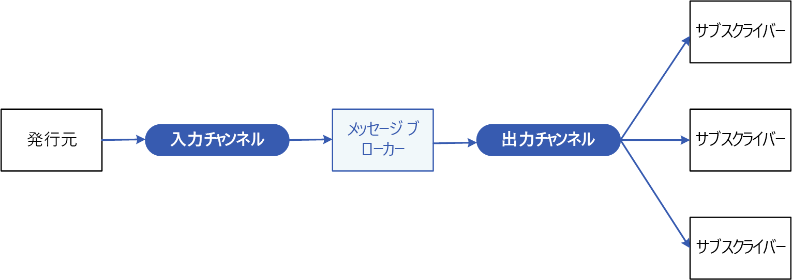
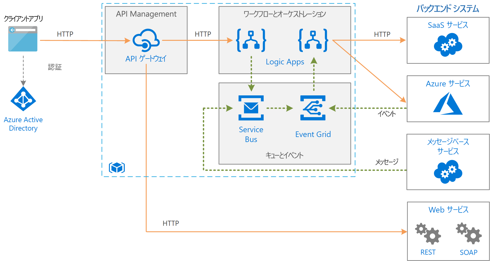

# パブリッシャーとサブスクライバーのパターンPublisher-Subscriber pattern

送信側と受信側を結合せずに、アプリケーションから複数の対象コンシューマーに対して非同期的にイベントを通知できるようにします。Enable an application to announce events to multiple interested consumers aynchronously, without coupling the senders to the receivers.

**別名**:パブリッシュ/サブスクライブ メッセージング**Also called**: Pub/sub messaging

## コンテキストと問題Context and problem

クラウド ベースの分散アプリケーションでは、システムのコンポーネントは、多くの場合、イベントが発生したときに他のコンポーネントに情報を提供する必要があります。In cloud-based and distributed applications, components of the system often need to provide information to other components as events happen.

非同期メッセージングは、送信者をコンシューマーから切り離し、送信者が応答を待機するのをブロックしないようにする有効な方法です。Asynchronous messaging is an effective way to decouple senders from consumers, and avoid blocking the sender to wait for a response. ただし、各コンシューマーのために専用のメッセージ キューを使用しても、多数のコンシューマーに対して効果的にスケーリングすることにはなりません。However, using a dedicated message queue for each consumer does not effectively scale to many consumers. また、一部のコンシューマーは、情報のサブセットにのみ興味を持っている場合があります。Also, some of the consumers might be interested in only a subset of the information. 送信者はどのようにすれば、ID を知らずに、対象のコンシューマー全員にイベントを通知できるでしょうか。How can the sender announce events to all interested consumers without knowing their identities?

## 解決策Solution

以下を含む非同期メッセージング サブシステムを導入します。Introduce an asynchronous messaging subsystem that includes the following:

- 送信者によって使用される入力メッセージング チャネル。An input messaging channel used by the sender. 送信者は、既知のメッセージ形式を使用して、メッセージ内にイベントをパッケージ化し、入力チャネルを介してこれらのメッセージを送信します。The sender packages events into messages, using a known message format, and sends these messages via the input channel. このパターンの送信者は、*パブリッシャー*とも呼ばれます。The sender in this pattern is also called the *publisher*.

  > [!NOTE]
  > *メッセージ*はデータのパケットです。A *message* is a packet of data. *イベント*は、発生した変更またはアクションについて、その他のコンポーネントに通知するメッセージです。An *event* is a message that notifies other components about a change or an action that has taken place.

- コンシューマーごとに 1 つの出力メッセージング チャネル。One output messaging channel per consumer. コンシューマーは*サブスクライバー*とも呼ばれます。The consumers are known as *subscribers*.

- そのメッセージに関心があるすべてのサブスクライバーのために、入力チャネルから出力チャネルに各メッセージをコピーするためのメカニズム。A mechanism for copying each message from the input channel to the output channels for all subscribers interested in that message. この操作は通常、メッセージ ブローカーやイベント バスなどの仲介機能によって処理されます。This operation is typically handled by a intermediary such as a message broker or event bus.

次の図は、このパターンの論理コンポーネントを示しています。The following diagram shows the logical components of this pattern:

 
パブリッシュ/サブスクライブ メッセージングには以下の利点があります。Pub/sub messaging has the following benefits:

- これにより、まだ通信する必要があるサブシステムが切り離されます。It decouples subsystems that still need to communicate. サブシステムは別個に管理可能で、1 つまたは複数の受信者がオフラインになっている場合でも、メッセージを正しく管理できます。Subsystems can be managed independently, and messages can be properly managed even if one or more receivers are offline.

- スケーラビリティが向上し、送信者の応答性が向上します。It increases scalability and improves responsiveness of the sender. 送信者は入力チャネルにすばやく単一のメッセージを送信し、担っているコアの処理に戻ることができます。The sender can quickly send a single message to the input channel, then return to its core processing responsibilities. 興味を持っているサブスクライバーに確実にメッセージが配信されるようにすることは、メッセージング インフラストラクチャが行います。The messaging infrastructure is responsible for ensuring messages are delivered to interested subscribers.

- そのため、信頼性が向上します。It improves reliability. 非同期メッセージングは、増加した負荷のもとでアプリケーションがスムーズに実行され続けるようにして、断続的なエラーをより効果的に処理する助けとなります。Asynchronous messaging helps applications continue to run smoothly under increased loads and handle intermittent failures more effectively.

- 遅延処理やスケジュールされた処理が可能です。It allows for deferred or scheduled processing. サブスクライバーがオフピークの時間までメッセージの取得を待機することも、特定のスケジュールに従って、メッセージのルーティングまたは処理を行うこともできます。Subscribers can wait to pick up messages until off-peak hours, or messages can be routed or processed according to a specific schedule.

- 異なるプラットフォーム、プログラミング言語、または通信プロトコルを使用するシステム間だけでなく、オンプレミス システムとクラウドで実行されるアプリケーション間の統合をより簡単にすることができます。It enables simpler integration between systems using different platforms, programming languages, or communication protocols, as well as between on-premises systems and applications running in the cloud.

- 企業全体にわたる非同期ワークフローが容易になります。It facilitates asynchronous workflows across an enterprise.

- テストの容易性が向上します。It improves testability. チャネルを監視することができ、全体の統合テスト戦略の一部として、メッセージの検査やログへの記録が可能です。Channels can be monitored and messages can be inspected or logged as part of an overall integration test strategy.

- アプリケーションの懸念事項の分離が提供されます。It provides separation of concerns for your applications. メッセージング インフラストラクチャがメッセージを複数のコンシューマーに確実にルーティングするために必要なすべてを処理している間、各アプリケーションはコア機能に集中できます。Each application can focus on its core capabilities, while the messaging infrastructure handles everything required to reliably route messages to multiple consumers. 

## 問題と注意事項Issues and considerations

このパターンの実装方法を決めるときには、以下の点に注意してください。Consider the following points when deciding how to implement this pattern:

- **既存のテクノロジ。****Existing technologies.** 独自に構築するのではなく、パブリッシュ-サブスクライブ モデルをサポートしている、入手できるメッセージング製品とサービスを使用することを強くお勧めします。It is strongly recommended to use available messaging products and services that support a publish-subscribe model, rather than building your own. Azure では、[Service Bus](/azure/service-bus-messaging/) または [Event Grid](/azure/event-grid/) の使用を検討してください。In Azure, consider using [Service Bus](/azure/service-bus-messaging/) or [Event Grid](/azure/event-grid/). パブリッシュ/サブスクライブ メッセージング用に使用できるその他のテクノロジには、Redis、RabbitMQ、Apache Kafka が含まれます。Other technologies that can be used for pub/sub messaging include Redis, RabbitMQ, and Apache Kafka.

- **サブスクリプションの処理。****Subscription handling.** メッセージング インフラストラクチャでは、コンシューマーがチャネルのサブスクライブまたはサブスクライブ解除に使用できるメカニズムを提供する必要があります。The messaging infrastructure must provide mechanisms that consumers can use to subscribe to or unsubscribe from available channels.

- **セキュリティ。****Security.** 承認されていないユーザーやアプリケーションによる盗聴を防ぐため、どのメッセージ チャネルへの接続も、セキュリティ ポリシーによって制限する必要があります。Connecting to any message channel must be restricted by security policy to prevent eavesdropping by unauthorized users or applications.

- **メッセージのサブセット。****Subsets of messages.** サブスクライバーは、通常、パブリッシャーによって配布されるメッセージのサブセットにのみ興味を持っています。Subscribers are usually only interested in subset of the messages distributed by a publisher. メッセージング サービスでは、多くの場合、受信したメッセージのセットをサブスクライバーが絞り込むことができます。Messaging services often allow subscribers to narrow the set of messages received by:

  - **トピック。****Topics.** 各トピックには専用の出力チャネルがあり、各コンシューマーは、すべての関連トピックをサブスクライブできます。Each topic has a dedicated output channel, and each consumer can subscribe to all relevant topics.
  - **コンテンツのフィルター処理。****Content filtering.** 各メッセージのコンテンツに基づいてメッセージの検査と配布が行われます。Messages are inspected and distributed based on the content of each message. 各サブスクライバーは、興味のあるコンテンツを指定できます。Each subscriber can specify the content it is interested in.

- **ワイルドカード サブスクライバー。****Wildcard subscribers.** サブスクライバーによる、ワイルドカードを使用した複数トピックのサブスクライブを許可することを検討してください。Consider allowing subscribers to subscribe to multiple topics via wildcards.

- **双方向通信。****Bi-directional communication.** パブリッシュ-サブスクライブ システムのチャネルは、一方向として扱われます。The channels in a publish-subscribe system are treated as unidirectional. 特定のサブスクライバーが受信確認の送信や、パブリッシャーに状態を返す通信を行う必要がある場合は、[要求/応答パターン](http://www.enterpriseintegrationpatterns.com/patterns/messaging/RequestReply.html)の使用を検討します。If a specific subscriber needs to send acknowledgement or communicate status back to the publisher, consider using the [Request/Reply Pattern](http://www.enterpriseintegrationpatterns.com/patterns/messaging/RequestReply.html). このパターンでは、1 つのチャネルを使用してサブスクライバーにメッセージが送信され、パブリッシャーに返す通信には別個の応答チャネルが使用されます。This pattern uses one channel to send a message to the subscriber, and a separate reply channel for communicating back to the publisher.

- **メッセージの順序付け。****Message ordering.** コンシューマー インスタンスでは、メッセージを受け取る順序は保証されません。また、受け取る順序に、メッセージが作成された順序が反映されるとは限りません。The order in which consumer instances receive messages isn't guaranteed, and doesn't necessarily reflect the order in which the messages were created. メッセージ処理の順序への依存をなくす助けになるように、メッセージ処理がべき等になるようにシステムを設計します。Design the system to ensure that message processing is idempotent to help eliminate any dependency on the order of message handling.

- **メッセージの優先度。****Message priority.** 一部のソリューションでは、特定の順序でメッセージが処理される必要があります。Some solutions may require that messages are processed in a specific order. [Priority Queue パターン](priority-queue.md)は、特定のメッセージが確実に、他のメッセージより前に配信されるようにするメカニズムを提供します。The [Priority Queue pattern](priority-queue.md) provides a mechanism for ensuring specific messages are delivered before others.

- **有害メッセージ。****Poison messages.** 不適切な形式のメッセージ、または使用できないリソースにアクセスする必要があるタスクによって、サービス インスタンスが失敗する可能性があります。A malformed message, or a task that requires access to resources that aren't available, can cause a service instance to fail. システムでは、そのようなメッセージがキューに返されないようにする必要があります。The system should prevent such messages being returned to the queue. 代わりに、必要な場合は分析できるように、これらのメッセージの詳細を他の場所でキャプチャして保存します。Instead, capture and store the details of these messages elsewhere so that they can be analyzed if necessary.

- **メッセージの繰り返し。****Repeated messages.** 同じメッセージが複数回送信されることがあります。The same message might be sent more than once. たとえば、送信者がメッセージ投稿後に失敗することがあります。For example, the sender might fail after posting a message. その後、送信者の新しいインスタンスが起動されて、メッセージを繰り返します。Then a new instance of the sender might start up and repeat the message. 多くて 1 回のメッセージ配信を提供するために、メッセージング インフラストラクチャには、メッセージ ID に基づく重複メッセージの検出と削除 (重複除外とも呼ばれます) を実装する必要があります。The messaging infrastructure should implement duplicate message detection and removal (also known as de-duping) based on message IDs in order to provide at-most-once delivery of messages.

- **メッセージの有効期限。****Message expiration.** メッセージの有効期間は制限されていることがあります。A message might have a limited lifetime. この期間内に処理されない場合、もう関連がなくなった可能性があり、破棄する必要があります。If it isn't processed within this period, it might no longer be relevant and should be discarded. 送信者は、メッセージ内のデータの一部として、有効期限の時間を指定できます。A sender can specify an experiation time as part of the data in the message. 受信者は、メッセージに関連付けられているビジネス ロジックを実行するかどうかを決める前に、この情報を調べることができます。A receiver can examine this information before deciding whether to perform the business logic associated with the message.

- **メッセージのスケジュール設定。****Message scheduling.** メッセージは、一時的に停止される可能性があり、特定の日付と時刻まで処理してはいけません。A message might be temporarily embargoed and should not be processed until a specific date and time. この時点まで、受信者がメッセージを使用できてはいけません。The message should not be available to a receiver until this time.

## このパターンを使用する状況When to use this pattern

このパターンは次の状況で使用します。Use this pattern when:

- アプリケーションは、非常に多くのコンシューマーに情報をブロードキャストする必要があります。An application needs to broadcast information to a significant number of consumers.

- アプリケーションは、独立して開発された 1 つまたは複数のアプリケーションまたはサービスと通信する必要があります。これらは、異なるプラットフォーム、プログラミング言語、および通信プロトコルを使用している可能性があります。An application needs to communicate with one or more independently-developed applications or services, which may use different platforms, programming languages, and communication protocols.

- アプリケーションは、コンシューマーからのリアルタイムの応答を必要とせずに、コンシューマーに情報を送信できます。An application can send information to consumers without requiring real-time responses from the consumers.

- 統合されようとしているシステムは、データの最終的整合性モデルをサポートするように設計されています。The systems being integrated are designed to support an eventual consistency model for their data.

- アプリケーションは、複数のコンシューマーに情報を通信する必要がありますが、これらには、送信者とは異なる可用性要件や稼働スケジュールがある場合もあります。An application needs to communicate information to multiple consumers, which may have different availability requirements or uptime schedules than the sender.

このパターンが適さない状況This pattern might not be useful when:

- 作成側アプリケーションの大きく異なる情報を必要とするコンシューマーが、数人だけしかいない場合。An application has only a few consumers who need significantly different information from the producing application.

- アプリケーションが、ほぼリアルタイムの、コンシューマーとの対話を必要とする場合。An application requires near real-time interaction with consumers.

## 例Example

次の図は、Service Bus を使用してワークフローを調整するエンタープライズ統合アーキテクチャと、Event Grid の、発生するイベントの通知サブシステムを示しています。The following diagram shows an enterprise integration architecture that uses Service Bus to coordinate workflows, and Event Grid notify subsystems of events that occur. 詳細については、「[メッセージ キューとイベントを使用した Azure でのエンタープライズ統合](../reference-architectures/enterprise-integration/queues-events.md)」を参照してください。For more information, see [Enterprise integration on Azure using message queues and events](../reference-architectures/enterprise-integration/queues-events.md).

## 関連のあるパターンとガイダンスRelated patterns and guidance

このパターンを実装する場合は、次のパターンとガイダンスが関連している可能性があります。The following patterns and guidance might be relevant when implementing this pattern:

- [メッセージを配信する Azure サービスの選択](/azure/event-grid/compare-messaging-services)。[Choose between Azure services that deliver messages](/azure/event-grid/compare-messaging-services).

- [イベント ドリブン アーキテクチャ スタイル](../guide/architecture-styles/event-driven.md)は、パブリッシュ/サブスクライブ メッセージングを使用するアーキテクチャ スタイルです。The [Event-driven architecture style](../guide/architecture-styles/event-driven.md) is an architecture style that uses pub/sub messaging.

- [非同期メッセージングの基本](https://msdn.microsoft.com/library/dn589781.aspx)。[Asynchronous Messaging Primer](https://msdn.microsoft.com/library/dn589781.aspx). メッセージ キューは、非同期通信メカニズムです。Message queues are an asynchronous communications mechanism. コンシューマー サービスがアプリケーションに返信を送信する必要がある場合、状況に応じて何らかの形式の応答メッセージングを実装します。If a consumer service needs to send a reply to an application, it might be necessary to implement some form of response messaging. 「Asynchronous Messaging Primer」(非同期メッセージングの基本) では、メッセージ キューを使用して要求/返信メッセージングを実装する方法が説明されています。The Asynchronous Messaging Primer provides information on how to implement request/reply messaging using message queues.

- [オブザーバー パターン。](https://en.wikipedia.org/wiki/Observer_pattern)[Observer Pattern](https://en.wikipedia.org/wiki/Observer_pattern). パブリッシュ-サブスクライブ パターンは、非同期メッセージングによってオブザーバーからサブジェクトを切り離すことで、オブザーバー パターンを基盤として作成されています。The Publish-Subscribe pattern builds on the Observer pattern by decoupling subjects from observers via asynchronous messaging.

- [メッセージ ブローカー パターン](https://en.wikipedia.org/wiki/Message_broker)。[Message Broker Pattern](https://en.wikipedia.org/wiki/Message_broker). パブリッシュ-サブスクライブ モデルをサポートする多くのメッセージング サブシステムは、メッセージ ブローカーによって実装されています。Many messaging subsystems that support a publish-subscribe modek are implemented via a message broker.
